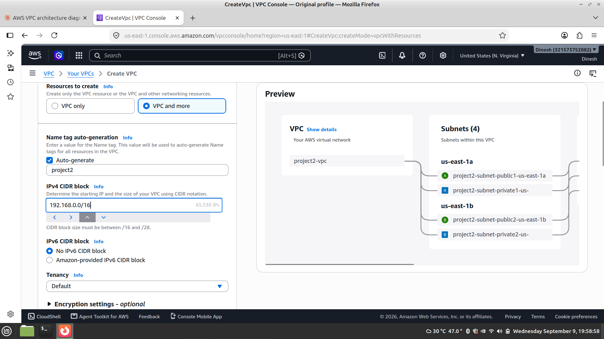
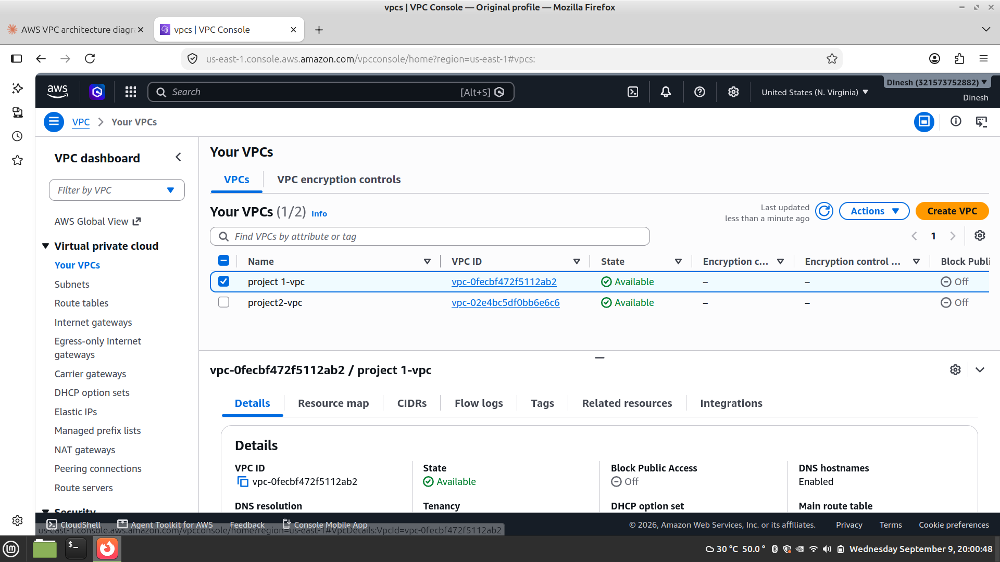
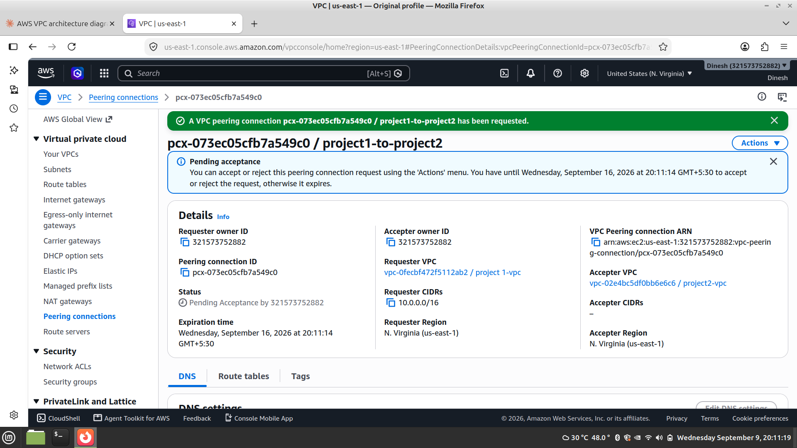
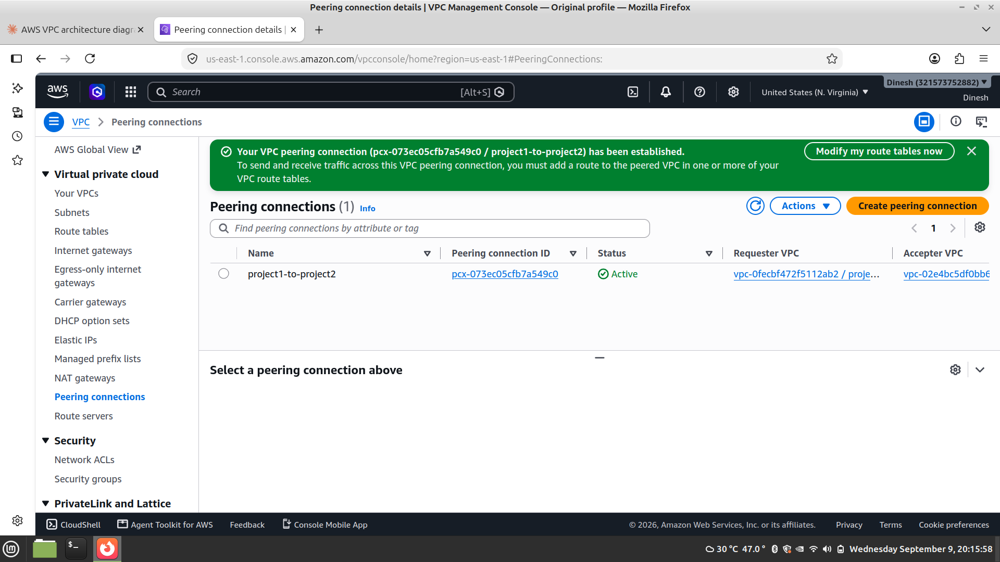
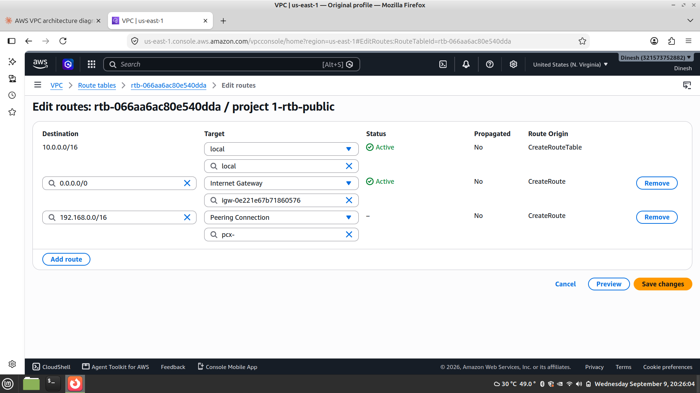
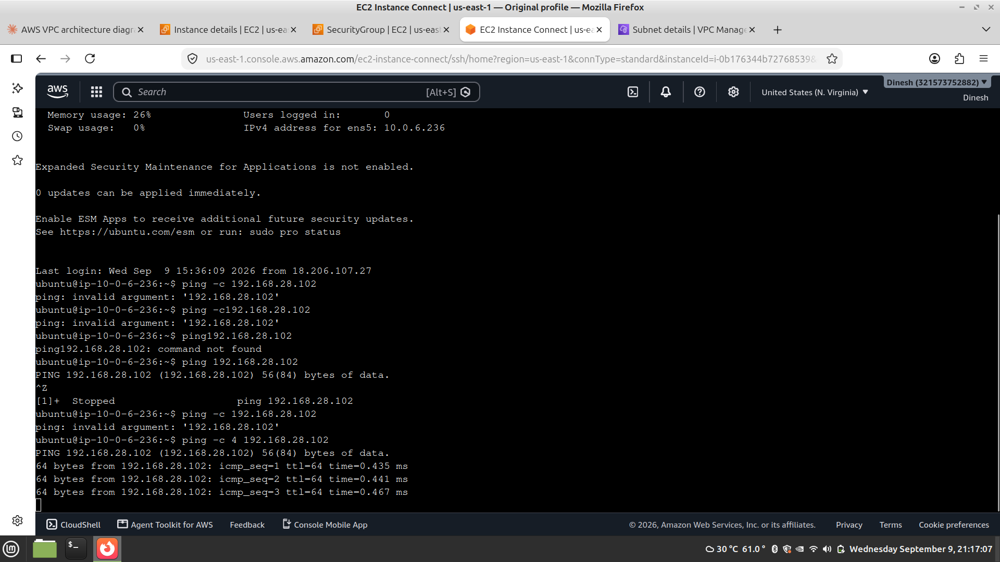
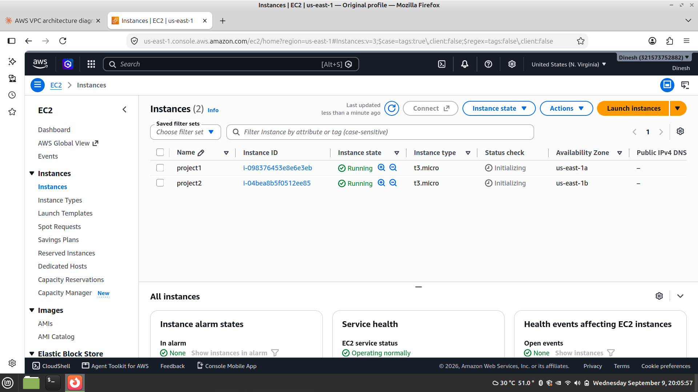

## 📸 Verification Screenshots

### Ping Connectivity Test

### Route Table & Peering Configuration

## 📸 Verification Screenshots

### ICMP Ping Verification (0% Packet Loss)

### Peering & Route Table Configurations

### Security Groups & Additional Verifications

